# TP N3: Introducción a infraestructura de servicios web con perspectiva de redes

### Integrantes
- Costamagna, Matias Javier
- de la Mata, Nicolas
- Quispe, Mateo
- Sabena, Maria Pilar

---

## Consigna 1 

### a) ¿Qué es SSH y qué problema resuelve?

**SSH** (*Secure Shell*) es un protocolo de red que permite acceder y administrar de forma segura un equipo remoto a través de una red insegura (como Internet).

Resuelve el problema de la **transmisión de datos en texto plano** que tenían protocolos anteriores como Telnet o rlogin. Con esos protocolos, cualquier persona que pudiera interceptar el tráfico de red (ataque de *sniffing*) podía leer comandos, contraseñas y toda la información transmitida. SSH soluciona esto estableciendo un **canal cifrado** entre cliente y servidor antes de intercambiar cualquier dato.

---

### b) Diferencia entre autenticación y cifrado

Aunque suelen trabajar juntos, son conceptos distintos:

| Concepto | ¿Qué garantiza? | Pregunta que responde |
|---|---|---|
| **Autenticación** | Que la entidad es quien dice ser | *¿Con quién estoy hablando?* |
| **Cifrado** | Que el contenido no puede ser leído por terceros | *¿Puede alguien más leer esto?* |

- **Autenticación** es el proceso de verificar la identidad de un usuario o sistema. En SSH, esto ocurre cuando el servidor verifica que el cliente que intenta conectarse es legítimo (por clave pública o contraseña). Stallings lo encuadra dentro de los servicios de seguridad como *autenticación de entidad par*.

- **Cifrado** (o encriptación) es la transformación de datos en texto plano a texto cifrado, de modo que solo quien posea la clave correcta pueda revertir el proceso y leerlos. Stallings lo trata en el contexto de la *confidencialidad*, uno de los pilares de la seguridad en redes.

> En SSH, **primero se autentica** y **luego se cifra** (nadie más puede leer lo que nos decimos).

---

### c) ¿Qué es una clave pública y una clave privada?

Son el par de claves usadas en la **criptografía asimétrica** (o de clave pública), descripta por Stallings como uno de los avances fundamentales en criptografía moderna.

- **Clave privada:** Es un valor secreto que solo posee su dueño. Nunca se comparte. Se usa para **firmar** o **descifrar** mensajes.

- **Clave pública:** Es derivada matemáticamente de la privada, pero no permite deducir la privada a partir de ella. Se puede distribuir libremente. Se usa para **verificar firmas** o **cifrar** mensajes dirigidos al dueño de la clave privada.

**¿Cómo funciona el principio?**  
Si alguien cifra un mensaje con tu clave pública, **solo tú** (con tu clave privada) podrás descifrarlo. Si tú firmas algo con tu clave privada, **cualquiera** con tu clave pública puede verificar que fue tuyo.

---

### d) ¿Por qué la clave privada no debe compartirse?

La clave privada es el **único secreto** que garantiza la identidad de su dueño. Si alguien más la obtiene:

1. **Puede hacerse pasar por vos** ante cualquier servidor que confíe en tu clave pública.
2. **Puede descifrar todos los mensajes** que te fueron enviados cifrados con tu clave pública.
3. **La autenticación pierde todo su valor**: ya no hay forma de distinguir al legítimo dueño de un impostor.

Stallings señala que en los sistemas de clave pública, la seguridad del esquema completo depende de que la clave privada permanezca secreta. A diferencia de la clave pública (cuya distribución es deseable), la exposición de la clave privada compromete irreversiblemente la seguridad del sistema para ese par de claves.

> En la práctica: si se sospecha que una clave privada fue comprometida, debe **revocarse y reemplazarse** inmediatamente.

---

### e) ¿Qué ventajas tienen las claves SSH frente a contraseñas?

| Criterio | Contraseña | Clave SSH |
|---|---|---|
| **Transmisión por red** | Aunque cifrada en SSH, se envía al servidor | La clave privada **nunca** sale del cliente |
| **Susceptibilidad a fuerza bruta** | Alta, especialmente si es corta o predecible | Extremadamente baja (clave de 2048–4096 bits) |
| **Phishing** | Puede ser capturada en sitios falsos | No aplica: el servidor debe conocer la clave pública previamente |
| **Automatización segura** | Requiere intervención humana o almacenamiento inseguro | Se pueden usar sin intervención humana de forma segura |
| **Reutilización** | Muchos usuarios repiten contraseñas | Cada par de claves es único |

La ventaja más importante desde el punto de vista de Stallings es que con claves SSH se implementa un esquema de **autenticación de desafío-respuesta** basado en criptografía asimétrica: el servidor envía un desafío cifrado con la clave pública del usuario, y solo quien posee la clave privada puede responderlo correctamente. Esto significa que **la información secreta nunca viaja por la red**, eliminando la posibilidad de capturarla mediante sniffing o ataques de repetición (*replay attacks*).

---

## Consigna 2

### Verificación de conexión SSH a la VM

Para verificar la conexión SSH a la VM se utilizó el siguiente comando:

```bash
ssh -i ./pc3_key.pem pc-alumnos-3@4.206.219.90
```

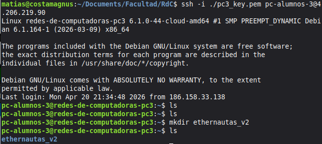

Una vez conectados, se creó la carpeta del grupo dentro de la VM:

```bash
mkdir ethernautas_v2
```

La captura muestra la conexión exitosa al sistema Debian GNU/Linux (kernel 6.1.0-44-cloud-amd64) y la carpeta `ethernautas_v2` creada correctamente.

---

## Consigna 3

### Captura de tráfico SSH con Wireshark

Se configuró Wireshark para capturar el tráfico hacia la IP de la VM y se inició una sesión SSH. El filtro utilizado fue:

```
ip.dst == 4.206.219.90
```

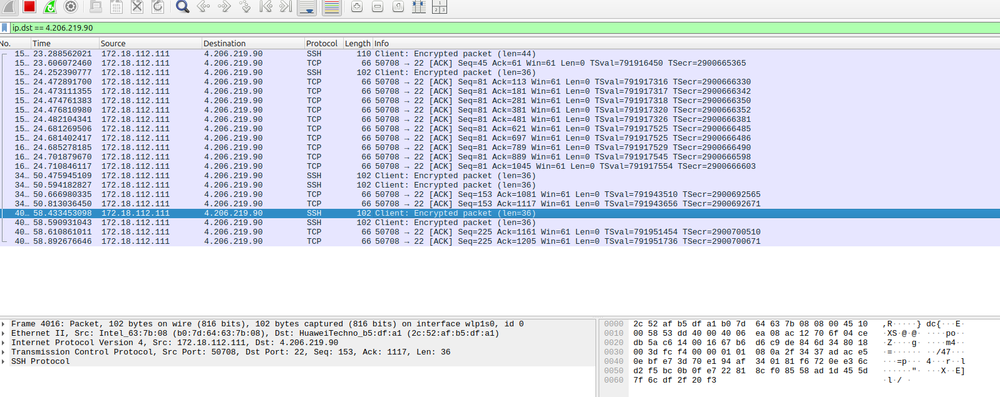

**¿Se puede descifrar el contenido?**

No. Como se observa en la captura, todos los paquetes SSH aparecen como `Client: Encrypted packet` o `Server: Encrypted packet`. SSH establece un canal cifrado (en este caso con AES-256-CTR) **antes** de transmitir cualquier dato de usuario. Wireshark puede ver los metadatos del paquete (IPs, puertos, longitudes) pero el payload es completamente ilegible sin la clave de sesión.

**¿Es la clave `.pem` la que cifra este tráfico?**

No. El par de claves pública/privada (el archivo `.pem`) cumple un rol exclusivo de **autenticación**: le demuestra al servidor que quien se conecta es el legítimo dueño de la clave privada. El cifrado del tráfico en sí se realiza con una clave de sesión distinta, generada durante el handshake. La clave pública viaja en ese proceso, pero la clave de sesión resultante nunca se transmite por la red, por lo que no puede capturarse con Wireshark.

---

## Consigna 4

### a) Servidor TCP con ncat

Se montó un servidor TCP en la VM escuchando en el puerto `5432`:

```bash
# En la VM (servidor)
sudo ncat -l 5432

# En la PC local (cliente)
ncat 4.206.219.90 5432
```

Se configuró Wireshark con el filtro `ip.dst == 4.206.219.90 and !ssh` para capturar únicamente el tráfico TCP no SSH hacia la VM.

**Three-way handshake y mensajes:**

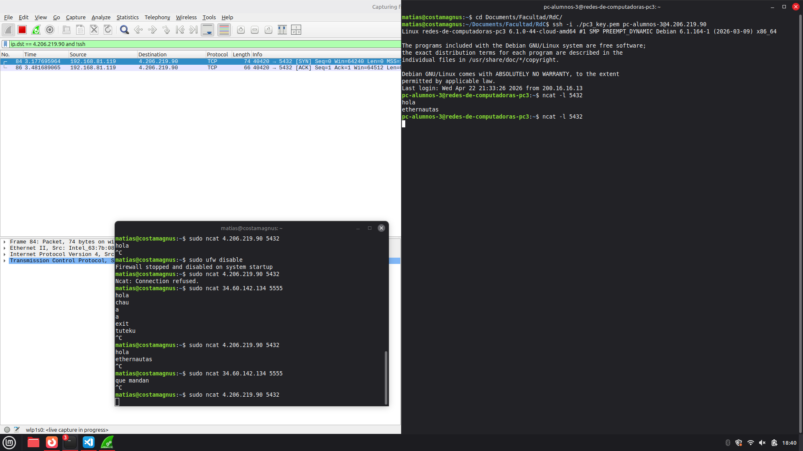

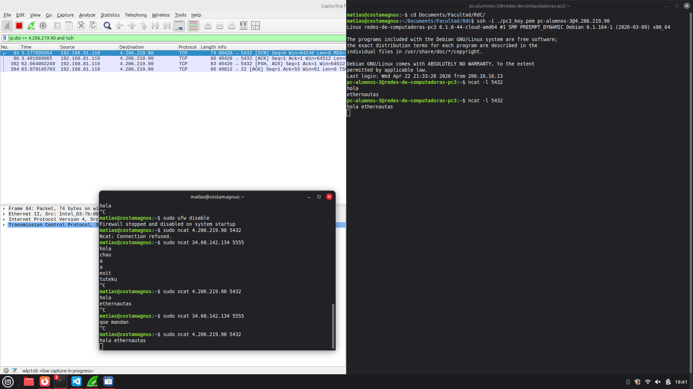

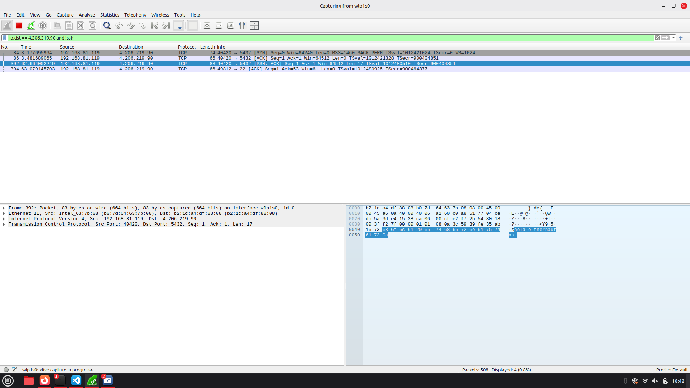

La captura muestra el handshake completo (SYN → SYN-ACK → ACK) seguido del intercambio de mensajes entre la PC local y la VM. **El contenido es completamente legible en texto plano** tanto en la vista de paquetes como en el panel de bytes de Wireshark: no hay ningún tipo de cifrado en esta comunicación.

---

### b) Servidor UDP con ncat

Se repitió el ejercicio usando protocolo UDP. ncat requiere el flag `-u` tanto en servidor como en cliente:

```bash
# En la VM (servidor)
sudo ncat -u -l 5432

# En la PC local (cliente)
ncat -u 4.206.219.90 5432
```

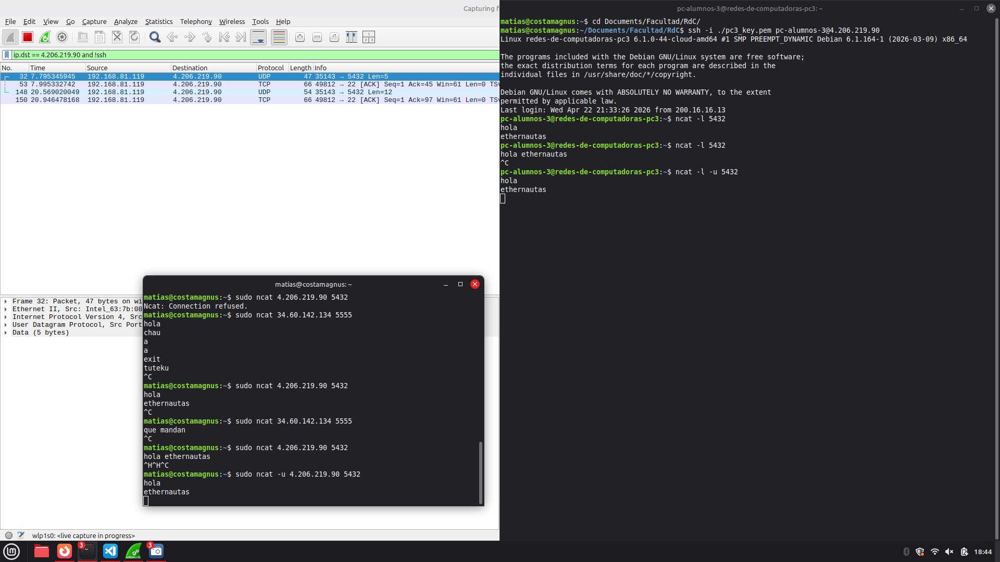

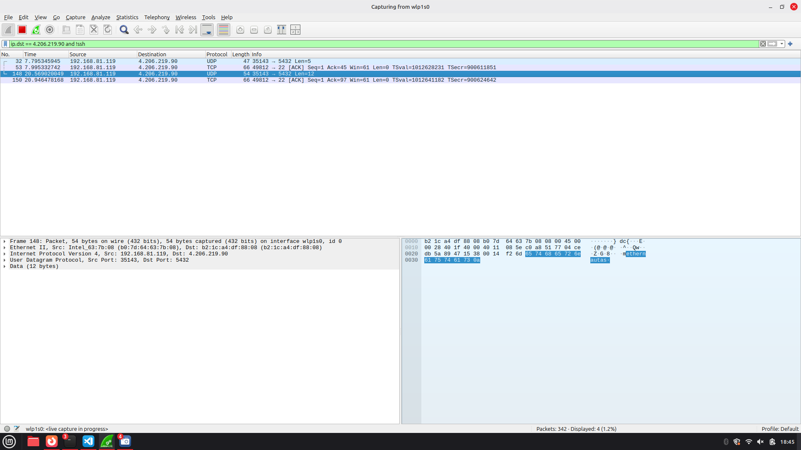

**Diferencias observadas respecto a TCP:**

- UDP **no realiza handshake**: los datos se envían directamente sin establecer conexión previa. En la captura se observa que no hay paquetes SYN/SYN-ACK/ACK.
- Los mensajes son igualmente **visibles en texto plano** en el análisis de bytes de Wireshark.
- UDP es un protocolo *connectionless*: no garantiza entrega, orden ni detección de errores a nivel de transporte.

---

### c) Chat ncat entre dos VMs

Se estableció una comunicación bidireccional tipo chat entre las dos VMs del grupo (pc3 en Azure y pc4 en Google Cloud) usando ncat. Una VM actúa como servidor escuchando en un puerto, y la otra se conecta como cliente:

```bash
# En pc3 (servidor — Azure, 4.206.219.90)
sudo ncat -l 5432

# En pc4 (cliente — Google Cloud)
ncat 4.206.219.90 5432
```

Una vez establecida la conexión, ambas VMs pueden enviarse mensajes de forma interactiva: lo que se escribe en una terminal aparece en la otra en tiempo real. La comunicación es **sin cifrado**: el contenido viaja en texto plano sobre TCP, exactamente igual que en el inciso a).

La diferencia respecto a los incisos anteriores es que ahora **ambos extremos son servidores remotos**, lo que demuestra que ncat no requiere que uno de los extremos sea una máquina local. Cualquier par de hosts con conectividad IP entre sí puede establecer este canal.

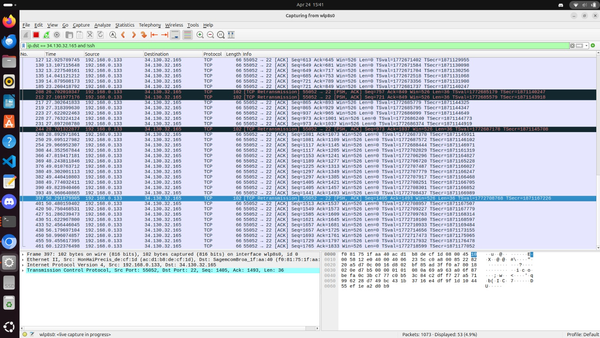

<video src="https://github.com/user-attachments/assets/b1091df9-49f7-4708-ab3c-acec6313227f" controls width="100%"></video>

---

## Consigna 5

### Servidor HTTP con Python

Dentro de la carpeta del grupo en la VM, se creó el archivo `index.html` y se desplegó un servidor HTTP:

```bash
cd ethernautas_v2
python3 -m http.server 5000
```

El mismo procedimiento se realizó en ambas VMs. Desde el navegador se accedió a cada una y se verificó el acceso:

**VM pc3 (Azure — `4.206.219.90`):**

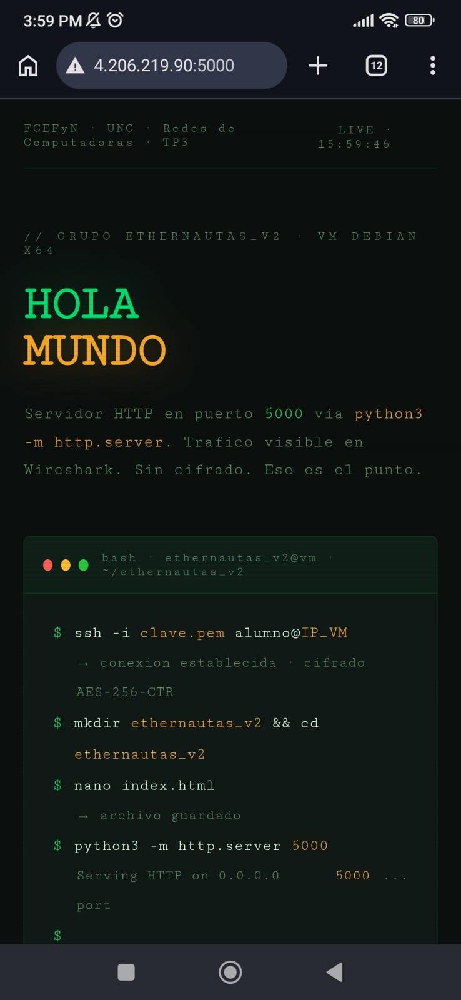

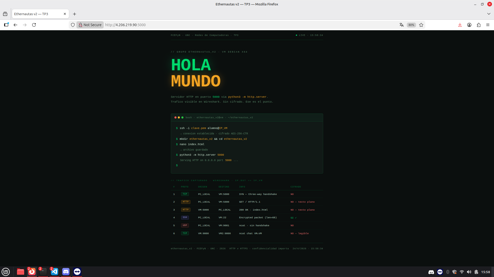

**VM pc4 (Google — `34.148.193.117`):**

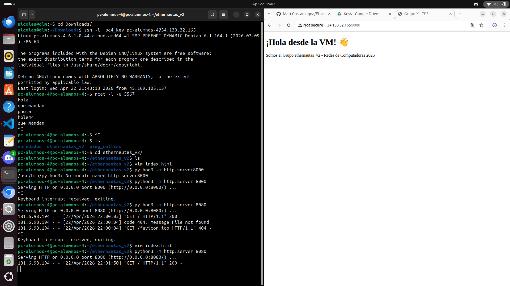

Se capturó el tráfico HTTP con Wireshark usando el filtro `ip.dst == 4.206.219.90 and !ssh`:

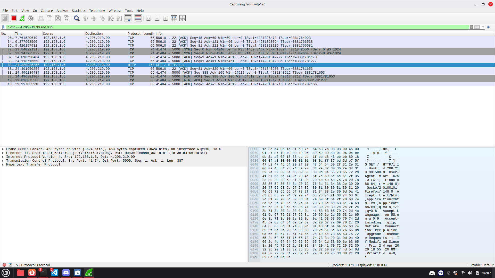

**¿Se puede descifrar el contenido HTTP?**

Sí. HTTP transmite todo en **texto plano**. En Wireshark se puede ver íntegramente el request (`GET / HTTP/1.1`) y el response con el HTML completo del `index.html`. No hay cifrado de ningún tipo.

**¿Se podría intervenir el contenido?**

Sí. Al tratarse de HTTP sin TLS, cualquier nodo intermedio en la ruta de red (router, ISP, atacante en la misma red) podría realizar un ataque **Man-in-the-Middle (MitM)**: interceptar la respuesta del servidor y modificar el HTML antes de que llegue al cliente, sin que ninguna de las partes lo detecte. Esto es precisamente el problema que resuelve HTTPS: al cifrar el canal con TLS, cualquier modificación en tránsito invalida la firma del certificado y el cliente rechaza la conexión.

---

## Consigna 6

### Contexto: vulnerabilidad en Apple Pay con tarjetas VISA en modo Express Transit

El video describe un ataque real que permite realizar pagos no autorizados desde un iPhone **bloqueado** usando Apple Pay si el usuario tiene una tarjeta VISA configurada en Express Transit mode.

El mecanismo combina dos características legítimas:

- **Express Transit Mode**: el iPhone responde a lectores NFC de tránsito sin requerir autenticación (sin Face ID ni código), identificando al lector mediante tramas **ECP (Enhanced Contactless Polling)**.
- **Transacciones VISA de tránsito**: VISA omite ciertos controles de seguridad (incluyendo límites de monto) para transacciones categorizadas como tránsito público, pensadas para operar en modo offline.

Un atacante puede combinar ambas: emitir tramas ECP falsas para activar Express Mode en el iPhone bloqueado, y retransmitir la comunicación NFC por internet hacia una terminal de pago convencional que declara la transacción como "tránsito". El resultado es un cobro arbitrario debitado sin que el usuario haya desbloqueado su teléfono ni aprobado nada.

---

### a) Relación con los TPs 1, 2 y 3

**TP 1 — Ruteo, ARP e integridad de datos**

En el TP1 aprendimos que el protocolo ARP no tiene mecanismo de autenticación: cualquier host puede responder una consulta ARP con información falsa (*ARP spoofing*), redirigiendo tráfico hacia sí mismo. El ataque de Apple Pay es conceptualmente análogo: el dispositivo del atacante emite tramas ECP falsas que el iPhone acepta sin verificar su autenticidad, igual que un host acepta una respuesta ARP sin validar que proviene del dueño legítimo de esa IP.

También en TP1 trabajamos detección de errores con XOR y paridad: esas técnicas garantizan **integridad** (que los datos no fueron alterados), pero no **autenticidad** (que los datos provienen de quien dice ser). En el ataque, la integridad del canal NFC no está en cuestión; lo que falla es la autenticidad del lector: el iPhone no puede distinguir un lector de tránsito real de uno falso.

**TP 2 — Capa física y equipamiento de red**

En el TP2 trabajamos con la capa física: cables, conectores, switches. Aprendimos que la capa física es el fundamento sobre el que se construyen todas las capas superiores, y que un problema en ese nivel (un par mal crimpado, una señal débil) invalida todo lo que viene encima.

NFC es también una capa física: opera por inducción electromagnética a ~13.56 MHz con alcance de centímetros. El relay attack del video es esencialmente un ataque a la **suposición de proximidad física** que NFC hace implícitamente: si una tarjeta responde a un lector, se asume que ambos están físicamente cerca. Los investigadores rompieron esa suposición retransmitiendo la señal por internet, demostrando que la capa física puede ser "extendida" artificialmente. Es el mismo principio que nos permitió en TP2 extender una LAN con un switch: el switch retransmite señales eléctricas entre segmentos.

**TP 3 — SSH, cifrado, HTTP y Wireshark**

El TP3 es donde la conexión es más directa:

- **Autenticación vs. cifrado (consigna 1b)**: aprendimos que son conceptos distintos. SSH autentica al cliente *y* cifra el canal. Express Transit Mode omite deliberadamente la autenticación para mejorar la usabilidad, y esa excepción es la raíz del ataque. El cifrado del canal NFC (si existiera) no aportaría nada si el atacante ya está en el medio retransmitiendo.

- **Man-in-the-Middle (consigna 5)**: al analizar el tráfico HTTP pudimos ver que cualquier nodo intermedio puede leer y modificar el contenido sin que las puntas lo detecten. En el ataque NFC, el atacante opera exactamente como ese nodo intermedio: intercepta la comunicación entre el iPhone y el terminal real, y la retransmite a su propio terminal. Es un relay MitM a nivel de capa física/aplicación de pago.

- **Texto plano en ncat TCP/UDP (consigna 4)**: demostramos que sin cifrado, el contenido es completamente visible y capturable con Wireshark. La comunicación EMV entre iPhone y terminal de pago, al ser retransmitida por el relay, también viaja sobre una red controlada por el atacante. Si esa comunicación no tiene protección de integridad extremo a extremo, el atacante podría modificarla en tránsito (por ejemplo, incrementar el monto).

- **SSH como contraejemplo correcto**: SSH resiste este tipo de ataque porque la clave de sesión se negocia mediante Diffie-Hellman y la identidad del servidor se verifica con su clave pública. Un relay SSH no puede "impersonar" al servidor legítimo sin la clave privada de ese servidor. El protocolo EMV en Express Mode no tiene un mecanismo equivalente para verificar la identidad del lector.

---

### b) Confidencialidad, integridad y los resultados del laboratorio

El principio de **confidencialidad** establece que la información solo debe ser accesible para las partes autorizadas. En el TP3 lo vimos en práctica: el tráfico HTTP y ncat viajaba en texto plano, visible para cualquier observador en la red. SSH y (conceptualmente) HTTPS resuelven esto cifrando el canal.

Sin embargo, el ataque de Apple Pay nos obliga a ampliar esa visión: **la confidencialidad sola no es suficiente**. El modelo de seguridad completo incluye tres pilares (la tríada CIA):

| Pilar | ¿Qué garantiza? | Falla en el ataque |
|---|---|---|
| **Confidencialidad** | Que nadie externo lee los datos | No es la falla principal aquí |
| **Integridad** | Que los datos no fueron alterados en tránsito | Parcialmente: VISA no verifica que el terminal declarado coincida con el terminal real |
| **Autenticidad / No repudio** | Que los datos provienen de quien dice ser | **Falla crítica**: el iPhone no puede verificar la identidad del lector NFC |

Del laboratorio se desprenden varias lecciones aplicables:

1. **Un canal sin autenticación del extremo es inseguro aunque esté cifrado.** El TP3 demostró que Wireshark no puede descifrar SSH, pero sí puede capturar HTTP. El ataque NFC muestra que incluso si el canal NFC tuviera cifrado, un relay que retransmite bytes cifrados de un extremo a otro sigue siendo efectivo: no necesita leer el contenido, solo retransmitirlo.

2. **La seguridad por capas requiere que cada capa valide sus propias suposiciones.** En el TP1 aprendimos que IP confía en la capa de enlace, y que eso puede explotarse con ARP spoofing. En el ataque NFC, VISA confía en que el iPhone solo activó Express Mode ante un lector de tránsito legítimo; el iPhone confía en que la trama ECP provino de un lector real. Cada capa asumió que la capa inferior ya hizo la validación.

3. **La usabilidad y la seguridad están en tensión permanente.** Express Mode se diseñó para que los usuarios no tengan que desbloquear el teléfono en el molino del subte. Esa decisión de diseño creó la superficie de ataque. Lo mismo ocurre en redes: HTTP sin TLS es más simple de implementar, pero el TP3 demostró que habilita la lectura y modificación del contenido. La elección entre comodidad y seguridad tiene consecuencias.

4. **Los protocolos deben validar datos en su propia capa, sin asumir la confianza de capas inferiores.** VISA debería verificar que las transacciones marcadas como "tránsito" provengan de terminales de tránsito verificadas, independientemente de lo que el iPhone haya reportado. Esta es exactamente la misma razón por la que HTTPS incluye certificados que el cliente verifica: no alcanza con que el canal esté cifrado, el cliente debe poder confirmar con quién está hablando.
