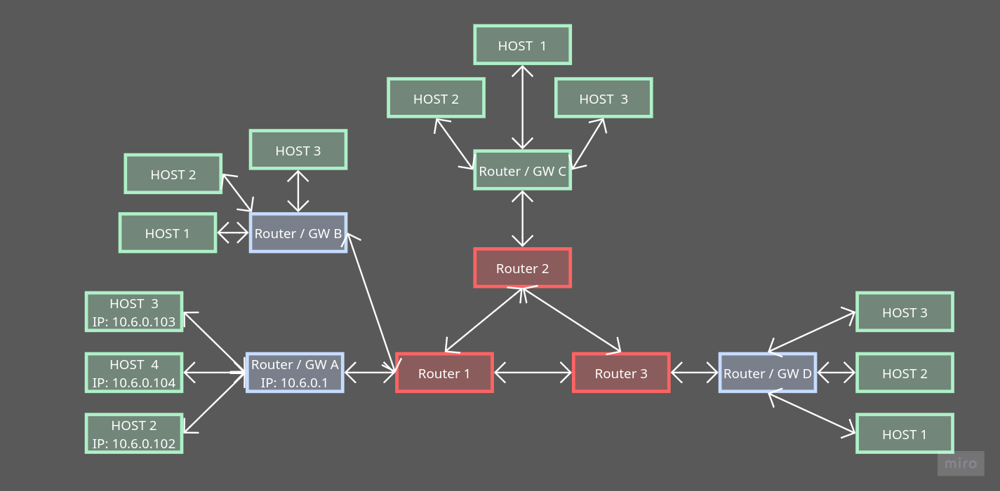

# Trabajo Práctico N°1

## Equipo: Ethernauthas v2

### Integrantes
- Costamagna, Matias Javier
- de la Mata, Nicolas
- Quispe, Mateo
- Sabena, Maria Pilar

---

## Parte 1: Repaso general didáctico: Simulación de envío de paquetes, ARP y ruteo entre redes.

1) Las configuraciones realizadas por los integrantes se encuentran en los archivos `Parte_1/Host2.md`, `Parte_1/Host3.md`, `Parte_1/Host4.md`, `Parte_1/Router.md`.
Cada uno de estos archivos contiene las tarjetas NIC correspondientes y los paquetes que hayan sido enviados/recibidos por cada dispositivo de nuestra LAN.
Consideramos necesario aclarar que inicialmente cometimos el error de no utilizar el Host1 debido a que nos confundimos en la asignación de los hosts dentro del equipo.
Además, la dirección MAC de uno de los Hosts utilizados no coincide con la que fue asignada a los integrantes del grupo, ya que integramos en el equipo a una companera cuyo equipo no asistió a la clase.

2) La topologia de la red WAN contiene las direcciones de nuestra red LAN obtenidas a partir del protocolo ARP (tabla en `Parte_1/Routing_Table.md`)

5)

- a)    La dirección IP destino se mantiene constante durante todo el recorrido porque pertenece a la capa de red y tiene alcance extremo a extremo: identifica al destinatario final del paquete y no es modificado por los routers intermedios durante el enrutamiento.
La dirección MAC, en cambio, pertenece a la capa de enlace de datos y tiene alcance estrictamente local: solo es válida entre dos nodos directamente conectados. En cada salto, el router realiza un proceso de desencapsulación y reencapsulación: descarta la trama entrante (y con ella la MAC origen/destino del segmento anterior), consulta su tabla de ruteo usando la IP destino, y construye una nueva trama con las MACs correspondientes al siguiente tramo, obtenidas mediante el protocolo ARP.
Esto evidencia una separación fundamental: el direccionamiento IP resuelve a dónde debe llegar el paquete en la red global, mientras que el direccionamiento MAC resuelve cómo entregarlo en cada segmento local.

- b)  Cuando un host quiere enviar un paquete a otra red, no intenta descubrir la MAC del destino final sino la del default gateway, porque ARP opera mediante broadcasts y los routers no los reenvían, por lo que la consulta nunca cruzaría hacia la red remota. El host entonces usa ARP dentro de su LAN para obtener la MAC del gateway, construyendo la trama con esa MAC como destino pero manteniendo la IP final del host remoto sin modificar.
El gateway resuelve el impedimento de que el host está limitado a su segmento local en capa 2 y no tiene mecanismo para entregar tramas fuera de él. El gateway, al operar en la capa de red, interconecta redes distintas superando ese límite.

- c)  La principal ventaja del modelo hop-by-hop es que cada router solo necesita conocer el siguiente salto hacia el destino, no el camino completo. Esto lo hace escalable: agregar nuevos nodos o redes no requiere que todos los routers actualicen una visión global de la topología.
Al distribuir la decisión de encaminamiento entre todos los nodos, se elimina también el punto único de fallo que tendría un esquema centralizado. Si un enlace o router falla, los nodos vecinos detectan el cambio y redirigen el tráfico por rutas alternativas, sin intervención del host origen. El mismo mecanismo permite adaptarse a la congestión: los routers ajustan sus decisiones según las condiciones actuales de la red.
- d) El frame Ethernet contiene direcciones MAC que solo tienen sentido dentro de un mismo segmento de red, el frame ya cumplio su funcion de transporte dentro de la red asi que el router lo descarta y arma uno nuevo con las MACs correctas para el siguiente enlance. Si en cambio el router reenviara el mismo frame sin modificarlo, el siguiente dispositivo recibira un frame con una MAC destino que no le corresponde y lo descartaria.
- e) El TTL previene que los paquetes queden circulando indefinidamente en la red sin alcanzar nignun host, como esto le puede pasar a muchos paquetes a la vez, los enlaces y routers se podrian saturar procesando tráfico inútil hasta colapsar.

## Parte 2: Inyección y detección de errores.