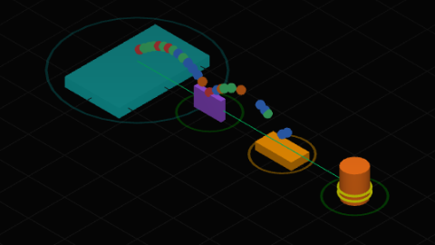
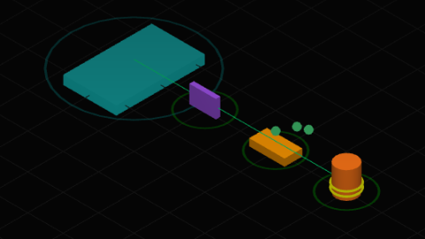
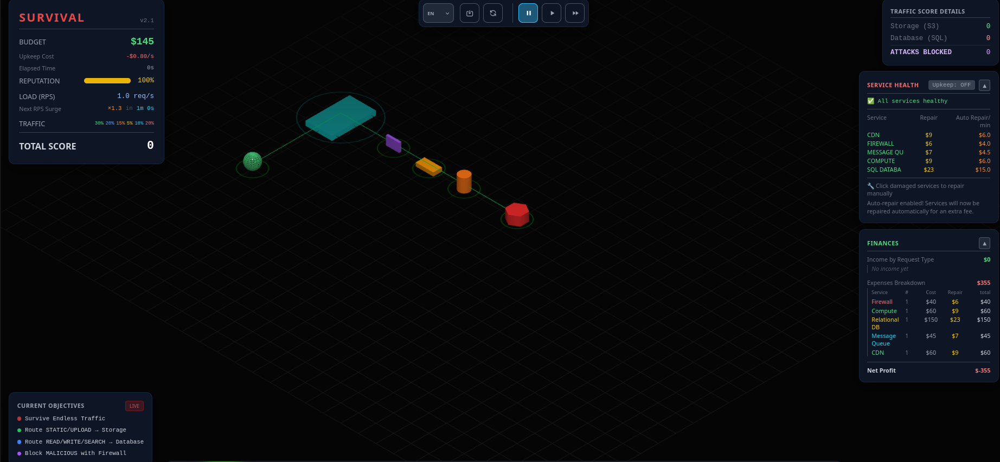
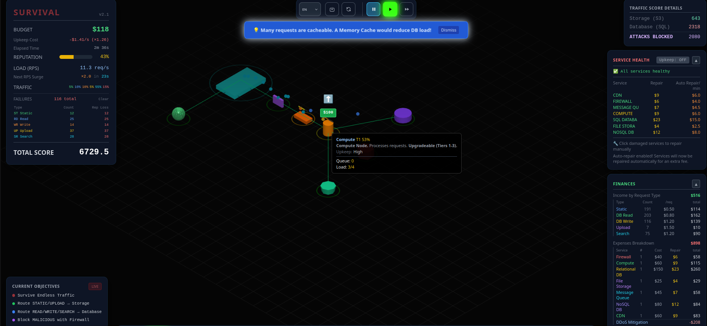
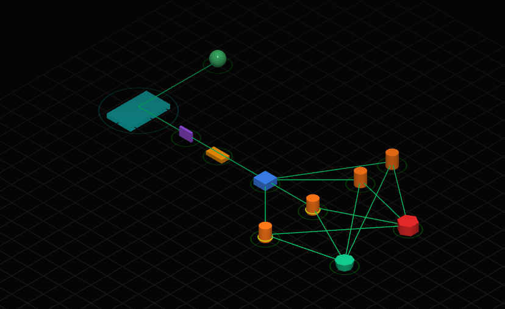
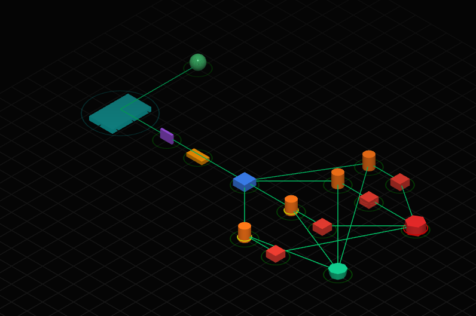
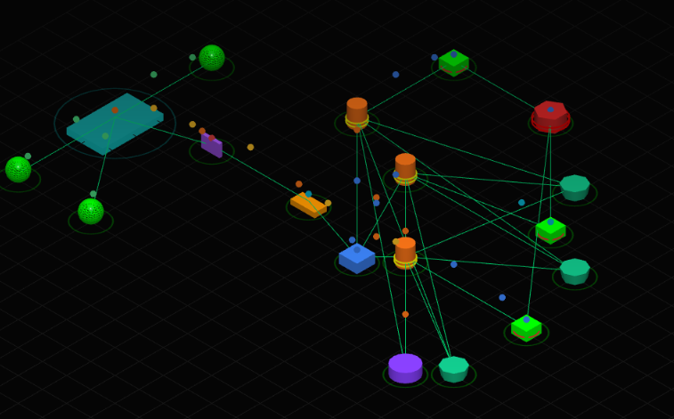
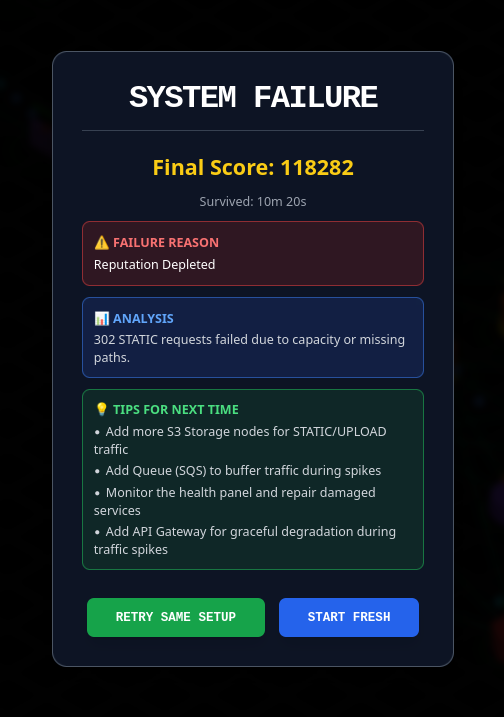

# Trabajo Práctico N°5 — Server Survival

### Integrantes
- Costamagna, Matias Javier
- de la Mata, Nicolas
- Quispe, Mateo
- Sabena, Maria

### Objetivos
- Comprender cómo una arquitectura de servicios responde ante distintos tipos de tráfico.
- Relacionar componentes de infraestructura cloud con conceptos de redes: ruteo, balanceo de carga, almacenamiento, bases de datos, caché, colas y filtrado de tráfico malicioso.
- Analizar fallas, cuellos de botella y decisiones de escalabilidad.

---

## 1) Reconocimiento de arquitectura

Para cada componente respondemos brevemente:
- **a)** ¿Qué problema resuelve?
- **b)** ¿En qué capa(s) del modelo TCP/IP ubicamos su función principal?
- **c)** ¿Qué pasaría si ese componente falta en una arquitectura real?

| Componente | Problema que resuelve | Capa TCP/IP | Si falta... |
|---|---|---|---|
| **Firewall** | Filtra tráfico entrante y saliente según reglas de seguridad, bloqueando accesos no autorizados y tráfico malicioso | Capas 3 (Red) y 4 (Transporte) — filtra por IP, puerto y protocolo; los NGFW también operan en capa 7 (Aplicación) | El sistema queda expuesto a ataques directos (DDoS, escaneo de puertos, exploits). Todo el tráfico llega sin filtro a los servidores internos |
| **Load Balancer** | Distribuye las solicitudes entrantes entre múltiples instancias de un servicio para evitar sobrecargar un único nodo | Capa 4 (Transporte) — balanceo por TCP/UDP; o capa 7 (Aplicación) — balanceo por URL, headers HTTP | Un único servidor recibe todo el tráfico: se convierte en punto único de fallo y el sistema no puede escalar horizontalmente |
| **Queue** | Desacopla productores y consumidores de mensajes, absorbe picos de carga y garantiza el procesamiento ordenado de tareas | Capa 7 (Aplicación) — opera sobre protocolos de mensajería (AMQP, etc.) | Los productores deben esperar a que el consumidor procese cada solicitud; ante picos de tráfico el sistema se satura y pierde solicitudes |
| **Compute** | Ejecuta la lógica de la aplicación (servidores de aplicación, VMs, contenedores) que procesa las solicitudes de negocio | Capa 7 (Aplicación) — ejecuta la lógica de negocio sobre datos recibidos vía red | Sin cómputo no hay procesamiento: el sistema no puede responder a ninguna solicitud dinámica |
| **Serverless Function** | Ejecuta fragmentos de código bajo demanda sin gestionar infraestructura; ideal para tareas puntuales o de baja frecuencia | Capa 7 (Aplicación) — funciones invocadas por eventos HTTP, colas o timers | Las tareas puntuales deben ejecutarse en servidores siempre activos, aumentando costo y complejidad operativa |
| **SQL DB** | Almacena datos estructurados con soporte a transacciones ACID, relaciones y consultas complejas | Capa 7 (Aplicación) — acceso mediante protocolos propios (PostgreSQL wire protocol, MySQL protocol, etc.) | Sin persistencia relacional se pierden datos transaccionales o deben almacenarse en soluciones sin garantías de consistencia |
| **NoSQL** | Almacena datos semi-estructurados o no estructurados con alta escalabilidad horizontal y esquema flexible | Capa 7 (Aplicación) — acceso vía HTTP/REST (documentales) o protocolos propios | Las cargas con datos variables o de alto volumen no se ajustan bien a esquemas rígidos; se pierde flexibilidad y escalabilidad |
| **Cache** | Guarda en memoria resultados de consultas frecuentes para reducir latencia y la carga sobre la base de datos | Capa 7 (Aplicación) — actúa sobre respuestas de la capa de aplicación | Cada solicitud va directamente a la base de datos; aumentan la latencia y los costos de cómputo en cargas con muchas lecturas repetidas |
| **CDN** | Distribuye contenido estático desde nodos geográficamente cercanos al usuario, reduciendo latencia y tráfico al origen | Capas 3/4 (enrutamiento del request al nodo más cercano) y 7 (entrega del contenido HTTP/HTTPS) | Todo el contenido estático se sirve desde el servidor de origen: mayor latencia para usuarios lejanos y mayor ancho de banda consumido |
| **Storage** | Provee almacenamiento persistente de objetos o archivos (imágenes, videos, backups) desacoplado del cómputo | Capa 7 (Aplicación) — acceso vía APIs REST (S3, GCS, etc.) | Los archivos deben guardarse en el disco local del servidor de cómputo, lo que impide escalar horizontalmente y genera pérdida de datos ante fallos |
| **Search Engine** | Indexa grandes volúmenes de datos y permite búsquedas de texto completo con alta performance y relevancia | Capa 7 (Aplicación) — consultas vía API REST o protocolo propio | Las búsquedas recaen sobre la base de datos principal con consultas `LIKE`, lo que degrada el rendimiento y no ofrece ranking por relevancia |
| **Réplica** | Mantiene copias sincronizadas de la base de datos para distribuir la carga de lecturas y proveer tolerancia a fallos | Capa 7 (Aplicación) — replicación de datos vía protocolo propio del motor de base de datos | Toda lectura y escritura cae sobre el nodo primario; ante su fallo se pierde disponibilidad y no hay recuperación inmediata |

---

## 2) Tipos de tráfico

El simulador trabaja con: **STATIC, READ, WRITE, UPLOAD, SEARCH, MALICIOUS**.

| Tipo de tráfico | Ejemplo real | Componente recomendado | Riesgo si se procesa incorrectamente |
|---|---|---|---|
| **STATIC** | Imágenes, CSS o JS de una página web | CDN / almacenamiento estático | Desperdiciar capacidad de cómputo si lo sirve un servidor de aplicación |
| **READ** | `GET` que consulta datos de usuario o llamadas a una API (ej.: ver un perfil o un listado de productos) | Base de datos SQL, con **caché** y **réplicas de lectura** para descargar al master | Saturar la DB master con lecturas repetidas que podrían resolverse desde caché; sube la latencia y se cae el servicio bajo carga |
| **WRITE** | `POST`/`PUT` que crea o actualiza registros (ej.: publicar un comentario, editar un perfil) | Base de datos SQL (o NoSQL para alto volumen) | Pérdida o inconsistencia de datos; las escrituras no se pueden cachear ni replicar libremente, así que se convierten en cuello de botella si se mezclan con las lecturas |
| **UPLOAD** | `POST` con archivo: subida de imágenes, videos o documentos | Almacenamiento de objetos (Storage / S3) | Si lo procesa el cómputo o se guarda en la DB se llenan memoria y disco rápido; archivos grandes bloquean el servidor de aplicación |
| **SEARCH** | `GET` con query: búsqueda full-text o filtros (ej.: buscador del sitio) | **Search Engine** dedicado (3× más rápido que SQL); NoSQL **no** lo resuelve | Si lo atiende la SQL DB, cada búsqueda es muy costosa (escaneos), satura la base y degrada también las READ/WRITE |
| **MALICIOUS** | DDoS, inyección SQL, bots de scraping | **Firewall / WAF** que lo bloquea en el borde | Si pasa al backend: caída de reputación, brechas de seguridad y consumo de recursos que debían atender tráfico legítimo |

---

## 3) Testeamos queues

Distribución de tráfico inicial usada:

| STATIC | READ | WRITE | UPLOAD | SEARCH | ATTACK |
|---|---|---|---|---|---|
| 30% | 20% | 15% | 5% | 10% | 20% |

**Observaciones:**

- **Al incrementar el rate, ¿qué sucede después de la queue?**

Al incrementar el rate la queue mantiene la misma taza de salida sin importar el traffic rate de ingreso.

- **Manteniendo el rate alto y luego bajándolo a cero rápidamente, ¿qué sucede después de la queue?**

Sigue entregando los paquetes almacenados.

**Capturas:**

- Esquema base

- Rate alto

- Drenado de la queue

**Conclusión sobre el rol de la cola (desacople productor/consumidor, absorción de picos):**

La cola sirve para poder manejar el proceso de paquetes segun la velocidad con la que nuestro servicio puede procesarlos, permitiendonos seguir respondiendo con un trafico alto sin perjudicar nuestro servicio.

---

## 4) Primera infraestructura mínima

La arquitectura debe intentar resolver: tráfico estático y uploads · lecturas y escrituras de datos · búsquedas · ataques / tráfico malicioso.

**Documentación con capturas:**

- a) Arquitectura inicial, b) presupuesto inicial y c) estado de salud de los servicios (todos al 100%)

La arquitectura inicial encadena: **Firewall → Compute → SQL DB / Storage**, sirviendo el tráfico estático y uploads contra el Storage, las lecturas/escrituras/búsquedas contra la SQL DB, y filtrando el tráfico malicioso en el Firewall. Al arrancar, todos los servicios están al **100% de salud**.

- d) Momento en que la arquitectura empieza a fallar

Al subir el rate y aumentar la proporción de tráfico dinámico, el **Compute** se degrada hasta el **59%** mientras el resto de los servicios (SQL DB, Storage, Firewall) se mantienen al **100%**. El propio simulador sugiere agregar una *Memory Cache* para descargar la base.

**Preguntas:**

- **¿Qué componente falló primero?**

El **Compute**. Fue el único que cayó (hasta 59%), mientras SQL DB, Storage y Firewall seguían al 100%.

- **¿Por qué creés que falló?**

Porque es el nodo donde **pasa todo el tráfico dinámico** (READ, WRITE, SEARCH y UPLOAD) antes de llegar a su destino. Al subir el rate, su cola se llena más rápido de lo que puede procesar y se satura primero. 

- **¿Fue un problema de capacidad, diseño, costo o seguridad?**

Principalmente de **capacidad** y de **diseño**: un único Compute, sin balanceador ni caché, se vuelve el cuello de botella y un punto único de fallo. No fue un problema de seguridad (el Firewall bloqueó el tráfico malicioso) ni de costo (sobraba presupuesto). Se resuelve escalando el Compute (más nodos + Load Balancer) y agregando una caché para quitarle carga, como se ve en el punto 5.

---

## 5) Escalabilidad y balanceo

Modificamos la arquitectura del punto 4 para soportar mayor tráfico. Probamos al menos **dos estrategias distintas** (opciones: más cómputo · balanceador de carga · caché · réplicas de lectura · cola de mensajes · separar servicios por tipo de tráfico).

Punto de partida (arquitectura del punto 4 al momento del fallo, con el Compute degradado al 59%):

### Estrategia 1: Escalado horizontal del Compute con Load Balancer
- **Cambio aplicado:** agregamos un **Load Balancer** delante del Compute y sumamos **instancias de Compute** adicionales, para repartir el tráfico dinámico entre varios nodos en lugar de uno solo.
- **Resultado observado (evidencia del simulador):** el cuello de botella del Compute se alivia; la salud deja de caer al 59% y el sistema soporta un rate más alto antes de degradarse.
- **Captura:** `

### Estrategia 2: Caché para descargar la base de datos
- **Cambio aplicado:** agregamos una **Memory Cache** (sugerida por el propio simulador) delante de la SQL DB para resolver las lecturas (READ) repetidas desde memoria y reducir la carga sobre la base.
- **Resultado observado (evidencia del simulador):** baja la carga sobre la SQL DB y el Compute, mejora la latencia y se sostiene mejor el tráfico de lecturas.
- **Captura:** `

- **¿Escalar horizontalmente siempre mejora el sistema? Justificá usando evidencia del simulador.**

No siempre. Escalar horizontalmente el componente que es **cuello de botella** (en nuestro caso el Compute) sí mejora el sistema, porque reparte la carga. Pero agregar nodos a un componente que **no** es el cuello de botella no aporta nada: solo gasta presupuesto sin mejorar la salud. Lo eficiente es identificar primero el componente saturado y escalar/descargar ese, combinando escalado horizontal con caché y réplicas según el tipo de tráfico.

---

## 6) Sobrevivir (modo Survival)

Diseñamos una arquitectura inicial sólida y tratamos de sobrevivir lo más posible mejorándola en modo **survival**.

**Arquitectura final:**

**Estadísticas finales:**

| Métrica | Valor |
|---|---|
| Elapsed Time | 10 min 20 s |
| Reputation | 0 % (agotada → causa del fallo) |
| Failures (total) | ≥ 302 (STATIC) |
| **TOTAL SCORE** | **118.282** |

**Explicación:**

- **¿Por qué elegiste cada componente?**
  Partimos de un **Firewall** en el borde para filtrar el tráfico MALICIOUS antes de que consuma recursos, seguido de un **Load Balancer** que reparte la carga entre los nodos de cómputo para evitar que uno solo se sature. Detrás ubicamos **Compute** para procesar READ/WRITE/SEARCH, **Storage/CDN** para servir el contenido STATIC y los UPLOAD, y una **SQL DB** más una **Cache** para acelerar las lecturas frecuentes. La idea fue cubrir cada tipo de tráfico con el componente que mejor lo absorbe.

- **¿Qué tráfico atiende cada uno?**
    **Firewall** → MALICIOUS (lo descarta). **CDN / Storage** → STATIC y UPLOAD. **Load Balancer + Compute** → READ, WRITE y SEARCH. **SQL DB + Cache** → persistencia y lecturas de datos. **Search Engine** → consultas SEARCH.

- **¿Qué cuello de botella apareció primero?**
  El de **tráfico STATIC**: **302 requests STATIC fallaron por falta de capacidad o de rutas**, lo que fue drenando la reputación hasta agotarla (causa final del fallo). El componente que sirve contenido estático (Storage/CDN) no dio abasto ante los picos.

- **¿Qué componente escalarías si tuvieras más presupuesto?**
  Sumaríamos **más nodos de Storage (S3) para STATIC/UPLOAD** y agregaríamos una **Queue** para amortiguar los picos de tráfico. Así atacaríamos directamente el cuello de botella que provocó el fallo.

---

## Conclusiones generales

