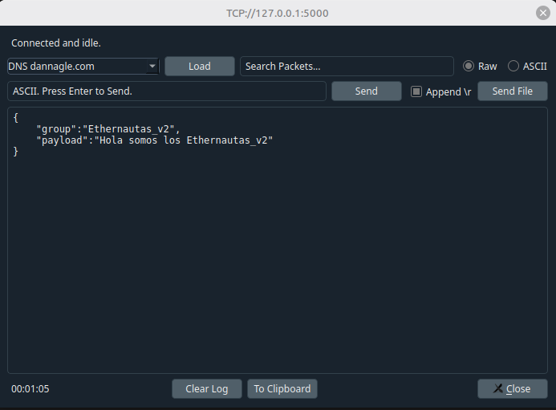
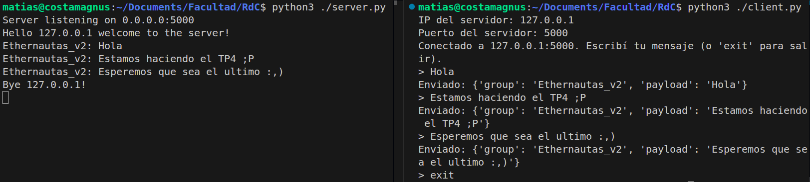
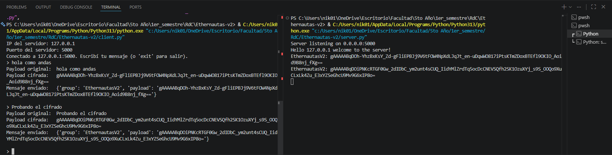
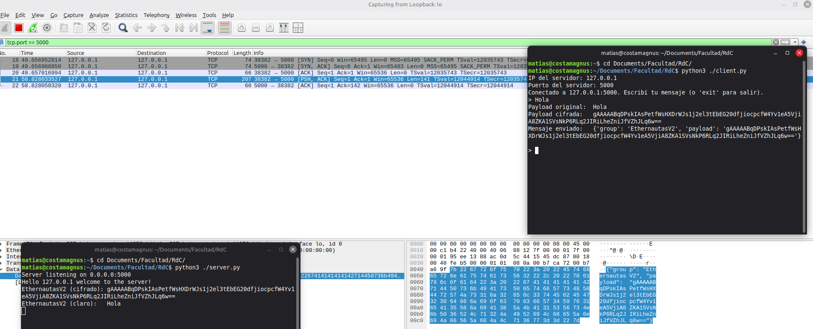

# TP N4: Infraestructura de servicios web con perspectiva de redes

### Integrantes
- Costamagna, Matias Javier
- de la Mata, Nicolas
- Quispe, Mateo
- Sabena, Maria Pilar

---

## Consigna 1

### a) ¿Qué es la serialización en redes de computadoras?

La **serialización** es el proceso de convertir una estructura de datos u objeto (residente en memoria) en una secuencia lineal de bytes o caracteres que puede ser transmitida a través de una red y reconstruida posteriormente por el receptor (**deserialización**).

En redes, esto es necesario porque los datos en memoria tienen referencias, punteros y formatos específicos de cada arquitectura o lenguaje que no son directamente transmisibles. La serialización los transforma en un formato portable y autocontenido que viaja como carga útil dentro de los paquetes de la capa de transporte. Sin serialización, dos programas escritos en distintos lenguajes o corriendo en distintas arquitecturas no podrían intercambiar estructuras de datos de forma interoperable.

---

### b) Diferencia entre serialización binaria y no binaria

| | **Binaria** | **No binaria (textual)** |
|---|---|---|
| **Formato** | Bytes crudos, no legible por humanos | Texto plano (ASCII/UTF-8) |
| **Ejemplos** | Protocol Buffers (protobuf), MessagePack, BSON, Avro | JSON, XML, YAML, CSV |
| **Ventajas** | Compacta (menor tamaño en bytes), más rápida de serializar/deserializar, eficiente para tipos numéricos y datos binarios nativos | Legible por humanos, fácil de depurar e inspeccionar, interoperable sin herramientas especiales, ampliamente soportada |
| **Desventajas** | Difícil de inspeccionar sin herramientas, menor interoperabilidad sin un esquema compartido, más compleja de implementar | Mayor tamaño en bytes, más lenta de parsear, tipos ambiguos (ej: JSON no distingue entero de flotante en todos los contextos) |

**Ejemplos concretos:**

- *JSON (no binario):* `{"group": "ethernautas", "payload": "hola"}` — transmitido exactamente como ese texto. Readable en Wireshark sin ningún procesamiento adicional.
- *Protocol Buffers (binario):* el mismo mensaje se codifica en ~15 bytes de datos compactos con campos identificados por número, ilegibles directamente pero mucho más eficientes en ancho de banda.

**En el contexto del TP:** se usa JSON, serialización **no binaria**. Esto facilita verificar los mensajes directamente en Wireshark o PacketSender sin herramientas adicionales, a costa de un mayor tamaño de paquete.

---

## Consigna 2

Se desplegó un servidor TCP multi-hilo implementado en Python (`server.py`). El servidor escucha en `0.0.0.0:5000` y atiende cada cliente en un hilo independiente, permitiendo conexiones simultáneas.

### a) Envío de mensajes con PacketSender

Los mensajes se serializaron en JSON con la morfología requerida:

```json
{
    "group": "Ethernautas_v2",
    "payload": "<mensaje/carga_útil>"
}
```

Se utilizó **PacketSender** en modo TCP persistente (opción *Persistent TCP*) para mantener la conexión abierta entre envíos y verificar que los mensajes llegaban correctamente al servidor.



El servidor validó el formato del mensaje y lo mostró por consola con el nombre del grupo remitente. En caso de recibir un mensaje con formato incorrecto o que no pudiera deserializarse como JSON, el servidor respondía con un aviso de mensaje mal formado.

### Cómo ejecutar el servidor

**Requisitos**

```bash
pip install cryptography
```

Iniciar el servidor (queda escuchando en `0.0.0.0:5000`, detener con `Ctrl+C`):

```bash
python server.py
```

---

## Consigna 3

Se implementó una aplicación de cliente en Python (`client.py`) que permite enviar mensajes al servidor desde la consola de forma interactiva.

### a) Configuración de IP y puerto

Al ejecutarse, el cliente solicita al usuario la IP y el puerto del servidor, establece una conexión TCP y mantiene la sesión abierta mientras el usuario envíe mensajes:

```
IP del servidor: 127.0.0.1
Puerto del servidor: 5000
Conectado a 127.0.0.1:5000. Escribí tu mensaje (o 'exit' para salir).
```

### b) Serialización de mensajes

Antes de enviar cada mensaje, el cliente lo empaqueta en el formato JSON que el servidor admite, codificándolo en UTF-8:

```python
message = {"group": GROUP, "payload": payload}
client.sendall(json.dumps(message).encode("utf-8"))
```

El campo `group` se fija en `"Ethernautas_v2"` y `payload` contiene el texto ingresado por el usuario.

### c) Verificación del funcionamiento

Se ejecutaron servidor y cliente en paralelo en la misma máquina (`127.0.0.1:5000`). El servidor recibió y mostró correctamente cada mensaje enviado desde el cliente:

```bash
python client.py
```

```
IP del servidor: 127.0.0.1
Puerto del servidor: 5000
Conectado a 127.0.0.1:5000. Escribí tu mensaje (o 'exit' para salir).
> hola
```



---

## Consigna 4

Se implementó cifrado **Fernet** sobre la payload del mensaje, dejando el campo `group` en texto claro.
 
### a) Cifrado en el cliente
 
Se utilizó la librería `cryptography` de Python. Una clave fija generada con `Fernet.generate_key()` se hardcodea en el cliente. Antes de serializar el mensaje, la payload se cifra:
 
```python
from cryptography.fernet import Fernet
 
KEY = b"<clave_generada>"
fernet = Fernet(KEY)
 
encrypted_payload = fernet.encrypt(payload.encode("utf-8")).decode("utf-8")
 
message = {
    "group": GROUP,
    "payload": encrypted_payload
}
```
 
### b) Verificación
 
El servidor recibe la payload completamente cifrada e ilegible. En la captura se observa que el campo `group` llega en claro (`EthernautasV2`) mientras que la payload es texto cifrado en base64:
 

 
### c) Características de Fernet

**Fernet** es un esquema de cifrado autenticado de alto nivel provisto por la librería `cryptography` de Python. Internamente combina dos mecanismos:

- **Cifrado simétrico (AES-128 en modo CBC):**
  El cifrado *simétrico* significa que la misma clave secreta se usa tanto para cifrar como para descifrar. Ambas partes deben conocerla de antemano (en este TP la clave está hardcodeada en el cliente).
  El algoritmo de cifrado es **AES** (*Advanced Encryption Standard*), el estándar de cifrado de bloque más utilizado hoy en día. La variante de 128 bits indica el tamaño de la clave. Opera en modo **CBC** (*Cipher Block Chaining*): el mensaje se divide en bloques y cada bloque se combina con el bloque cifrado anterior antes de cifrarse, de modo que bloques de texto iguales producen ciphertext diferente.

- **IV (Vector de Inicialización):**
  Para arrancar la cadena CBC, el primer bloque se combina con un valor inicial aleatorio llamado **IV** (*Initialization Vector*). Fernet genera un IV aleatorio en cada operación de cifrado, lo que garantiza que cifrar el mismo texto dos veces produce resultados completamente distintos. Esto impide que un atacante que analice el tráfico identifique mensajes repetidos.

- **Integridad y autenticidad (HMAC-SHA256):**
  El cifrado por sí solo no garantiza que el mensaje no fue alterado en tránsito. Por eso Fernet también firma el mensaje con **HMAC** (*Hash-based Message Authentication Code*): un código generado a partir de la clave y el contenido cifrado usando la función de hash **SHA-256**. Si un tercero modifica el ciphertext aunque sea en un bit, el receptor detecta la alteración y rechaza el mensaje. Esto significa que Fernet ofrece tanto *confidencialidad* (nadie puede leer el mensaje) como *autenticidad* (nadie puede modificarlo sin que se note).

- **Formato de salida (Base64 URL-safe):**
  El resultado del cifrado son bytes binarios. Para poder embeber ese resultado directamente en un JSON (que es texto), Fernet lo codifica en **Base64 URL-safe**: una representación textual de datos binarios que usa solo caracteres ASCII seguros para URLs (`A-Z`, `a-z`, `0-9`, `-`, `_`). Esto explica el aspecto del ciphertext que se observa en la captura.

- **Librería:** `cryptography` (Python) — `pip install cryptography`.

---

## Consigna 5

Se modificó el servidor (`server.py`) para que descifre la payload recibida usando la misma clave Fernet compartida con el cliente. El servidor ahora imprime tanto el texto cifrado (lo que viaja por la red) como el texto descifrado (el mensaje original).

```python
from cryptography.fernet import Fernet

KEY = b'l8U8GsZHvMg02wKlbGHf8EmkwfNs2GYvGgMTrOQSq2U='
fernet = Fernet(KEY)

# En handle_client:
encrypted = message["payload"]
decrypted = fernet.decrypt(encrypted.encode("utf-8")).decode("utf-8")
print(f"{message['group']} (cifrado): {encrypted}")
print(f"{message['group']} (claro):   {decrypted}")
```

### Captura de paquetes con Wireshark

Se capturó el tráfico en la interfaz loopback (`lo`) filtrando por `tcp.port == 5000`, con servidor y cliente corriendo en la misma máquina (`127.0.0.1:5000`).



En la captura se pueden observar simultáneamente tres elementos:

1. **Wireshark:** los paquetes TCP capturados contienen la payload Fernet en texto cifrado (cadena Base64 URL-safe comenzando con `gAAAAA...`). Un atacante que intercepte el tráfico en este punto solo vería ese ciphertext ilegible, sin poder recuperar el mensaje original sin la clave.

2. **Terminal del servidor (inferior izquierda):** el servidor recibe el paquete, extrae la payload cifrada, la descifra con Fernet y muestra ambas versiones: `(cifrado)` con el ciphertext tal como llegó, y `(claro)` con el texto original del mensaje. Esto confirma que el descifrado es exitoso en el extremo receptor.

3. **Terminal del cliente (derecha):** el cliente solicitó IP y puerto, envió el mensaje cifrado y mostró por consola la payload original junto con su versión cifrada antes del envío.

Esto demuestra el funcionamiento end-to-end del sistema: **los datos viajan cifrados sobre la red y solo el servidor, al poseer la clave compartida, puede recuperar el contenido original.**
