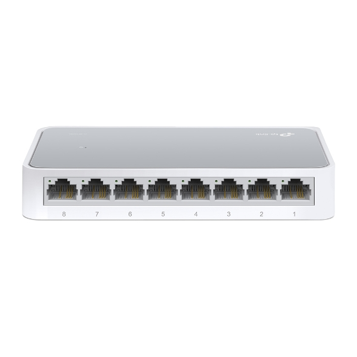

# TP-Link TL-SF1008D — Switch de 8 puertos 10/100 Mbps



## Características principales del switch

| Característica             | Detalle                                      |
|---------------------------|----------------------------------------------|
| Estándares                | IEEE 802.3, IEEE 802.3u, IEEE 802.3x, CSMA/CD |
| Puertos                   | 8 x RJ45 10/100 Mbps, Auto-Negociación, Auto-MDI/MDIX |
| Tasa de transferencia     | 10/100 Mbps (Half Duplex) / 20/200 Mbps (Full Duplex) |
| Control de flujo       | IEEE 802.3x (Full Duplex) / Back-Pressure (Half Duplex) |
| Método de transmisión  | Store-and-Forward                                        |

3) Para verificar la conectividad, cada grupo conectó su computadora al switch utilizando los cables armados en la Parte 1. Una vez establecida la conexión física, se procedió a realizar un ping hacia la PC de otro grupo para comprobar que la comunicación entre equipos funcionaba correctamente.

**Resultado:**

```
Pinging 169.254.105.129 with 32 bytes of data:
Reply from 169.254.105.129: bytes=32 time=1ms TTL=64
Reply from 169.254.105.129: bytes=32 time=1ms TTL=64
Reply from 169.254.105.129: bytes=32 time=1ms TTL=64
Reply from 169.254.105.129: bytes=32 time=1ms TTL=64

Ping statistics for 169.254.105.129:
    Packets: Sent = 4, Received = 4, Lost = 0 (0% loss),
Approximate round trip times in milli-seconds:
    Minimum = 1ms, Maximum = 1ms, Average = 1ms
```

**Análisis:**
- **4 paquetes enviados, 4 recibidos, 0% de pérdida** → conectividad perfecta.
- **Latencia de 1ms** → tiempo de respuesta mínimo, esperado en una red local cableada.
- El TTL de 64 indica que los paquetes llegaron sin pasar por ningún router (comunicación directa en capa 2 a través del switch).
- El protocolo **ICMP** (utilizado por `ping`) funcionó correctamente, lo que implica que también operó **ARP** previamente para resolver la dirección MAC correspondiente a la IP destino.

**Conclusión:** la conectividad entre grupos a través del switch fue exitosa. Los cables construidos en la Parte 1 funcionaron correctamente en condiciones reales de red.